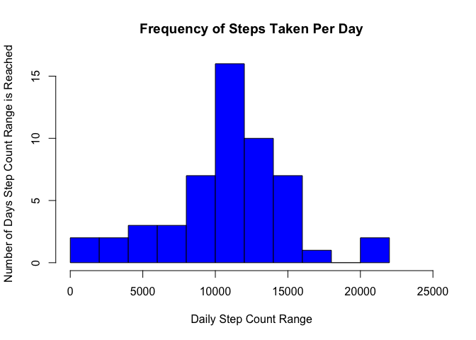
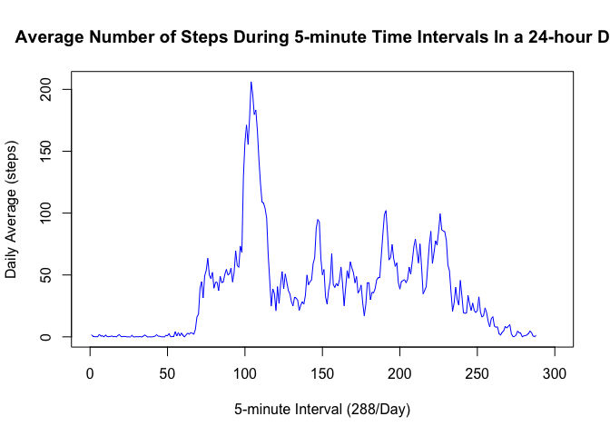
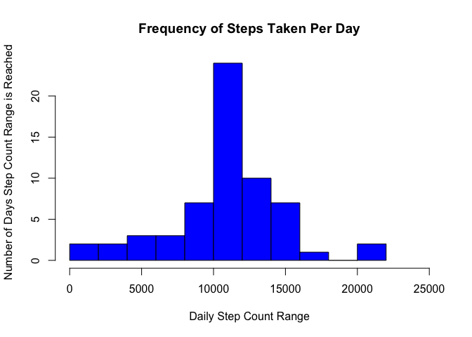

# Reproducible Research: Peer Assessment 1
Xiaosi Tan  
2014-11-11  

## Data
The data for this assignment can be downloaded from the course web site:

- Dataset: Activity monitoring data [52K]

The variables included in this dataset are:

- steps: Number of steps taking in a 5-minute interval (missing values are coded as NA)

- date: The date on which the measurement was taken in YYYY-MM-DD format

- interval: Identifier for the 5-minute interval in which measurement was taken

The dataset is stored in a comma-separated-value (CSV) file and there are a total of 17,568 observations in this dataset.

## Loading and preprocessing the data

After loading the data, we transform the date column to the Date format.


```r
# Check the existence of the file and unzip the .zip pack
file <- "./activity.csv"
if (!file.exists(file)) {
  unzip("./activity.zip", exdir="./")
}

# Read in the .csv file and transform the dates to Date format
activitydata <- read.csv("./activity.csv", colClasses = c("numeric","character","numeric"))
activitydata$date <- as.Date(activitydata$date, "%Y-%m-%d")
```

## What is mean total number of steps taken per day?

```r
## compute the total number of steps/day, and the mean and median
stepsperday <- aggregate(steps ~ date, data = activitydata, sum, na.rm=TRUE)
meanperday <- mean(stepsperday$steps)
medianperday <- median(stepsperday$steps)

meanperday
```

```
## [1] 10766.19
```

```r
medianperday
```

```
## [1] 10765
```

```r
hist(stepsperday$steps, main = "Frequency of Steps Taken Per Day", 
     xlab = "Daily Step Count Range",
     ylab = "Number of Days Step Count Range is Reached", breaks = 15,
     xlim = c(0, 25000), col = "blue")
```

 

The **mean** of steps taken per day is **10766**, the **median** is **10765**.

The histogram shows there're about **36** days which has steps above the mean. This number agrees with the number of weekdays in the two months.

## What is the average daily activity pattern?

The interval was marked as a number, in which the first 1 or 2 digits shows the number of hours passed and the last 2 digits shows the number of miniutes passed in the new hour. We add a new column by transformation of the interval column, which contains integers n, n means the n-th interval of the day.


```r
library(dplyr)
# create a new column which marks the number of the 5-min interval of the day
activitydata <- mutate(activitydata, 
            interval1 = ((activitydata$interval %% 100)/5 + 1) + activitydata$interval %/% 100 * 12)

# create the mean of the steps every 5-min interval across all dates
timeseries <- aggregate(steps ~ interval1, data = activitydata, mean, na.action = na.omit)

plot(timeseries$interval1, timeseries$steps, type = "l", xlab = "5-minute Interval (288/Day)", 
        ylab = "Daily Average (steps)", 
        main = "Average Number of Steps During 5-minute Time Intervals In a 24-hour Day", 
        col = "blue", xlim = c(0,300))
```

 

```r
# This function is to get the actual time period of the day when input the number
# of the 5-min interval.
gettimep <- function(x) {
  h1 <- (x*5) %/% 60
  h2 <- ((x+1)*5) %/% 60
  min1 <- (x*5) %% 60
  min2 <- ((x+1)*5) %% 60
  time <- paste(c(h1,h2), c(min1,min2), sep = ":")
  return(time)
}
```

The 5-min interval with **maximum** average number of steps is interval **104**, which is **8:40 ~ 8:45**.
The graph also reaches **local maxima** at **147**, **191** ,**226**, which correspond to **12:15 ~ 12:20**, **15:55 ~ 16:00**, **18:50 ~ 18:55**.

## Imputing missing values

```r
NAcount <- sum(is.na(activitydata$steps))
NAcount
```

```
## [1] 2304
```
There are **2304 missing values** in the data.

Missing values are filled with the average of steps in each 5-min interval across all dates. 

```r
library(reshape2)
#dcast the data into a wide form with steps, replace the NAs with the average calculated
#in the timeseries, and reshape it back to the long format
a <- dcast(activitydata, interval ~ date, value.var="steps", fill= timeseries$steps)
a2 <- reshape(a, direction = "long", varying=list(names(a)[2:length(names(a))]),
              v.names=c("steps"), timevar="date", idvar=c("interval"),
              times=names(a)[2:length(names(a))], new.row.names=1:dim(activitydata)[1])

a2$date <- as.Date(a2$date, "%Y-%m-%d")
```

Make a histogram of the total number of steps taken each day after filing the missing values.


```r
stepsperday2 <- aggregate(steps ~ date, data = a2, sum, na.rm=TRUE)
meanperday2 <- mean(stepsperday2$steps)
medianperday2 <- median(stepsperday2$steps)

meanperday2
```

```
## [1] 10766.19
```

```r
medianperday2
```

```
## [1] 10766.19
```

```r
hist(stepsperday2$steps, main = "Frequency of Steps Taken Per Day", 
     xlab = "Daily Step Count Range",
     ylab = "Number of Days Step Count Range is Reached", breaks = 15,
     xlim = c(0, 25000), col = "blue")
```

 

The **mean** of steps becomes **10766**. The **median** becomes **10766**.

The mean and median of the data doesn't change a lot after filling the missing value. The histogram is also in a similar shape, so the distribution shape doesn't change a lot, only the counts increased. 

## Are there differences in activity patterns between weekdays and weekends?

```r
# This function decides each item of the input vector to be weekday or weekend
# The input should be a vector of class date, the output is a vector with strins
# of "weekday" and "weekend", indicating the day of the given date.
isweekend <- function(x){
  dw <- weekdays(x)
  th <- character(0)
  for(i in 1:length(dw)){
    if(dw[i] %in% c("Saturday","Sunday")){
      th[i] = "weekend"
    }
    else{
      th[i] = "weekday"
    }
  }
  return(th)
}

# Add a new column which is a factor with two levels "weekday" and "weekend"
a2 <- mutate(a2, day = as.factor(isweekend(a2$date)))

# add the number of interval as above
a2 <- mutate(a2, interval1 = ((activitydata$interval %% 100)/5 + 1) + 
               activitydata$interval %/% 100 * 12)

# create the timeseries again, conditioned by "weekday" and "weekend"
stepsweekday <- aggregate(steps ~ interval1 + day, data = a2, mean)

library(lattice)
splot <- xyplot(steps ~ interval1 | day, stepsweekday, type = "l", layout = c(1, 2), 
                xlab = "5-minute Interval (288 per Day)", ylab = "Daily Average (steps)")
update(splot,
       main="Comparison of Average Number of Steps During 5-minute\nTime Intervals In a 24-hour   Day\nfor Weekend Days Versus Weekdays")
```

 

On the weekdays, the average steps peaked at the 104 interval, which corresponds to **8:40 ~ 8:45**.
There are also some local maxima but the maximum is the largest. On the weekends, we also have some peaks through the daytime, but it's distributed more uniformly than the weekdays.
